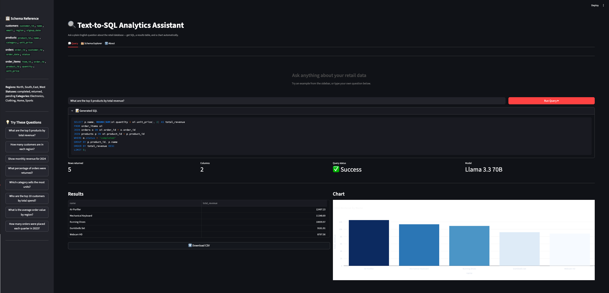
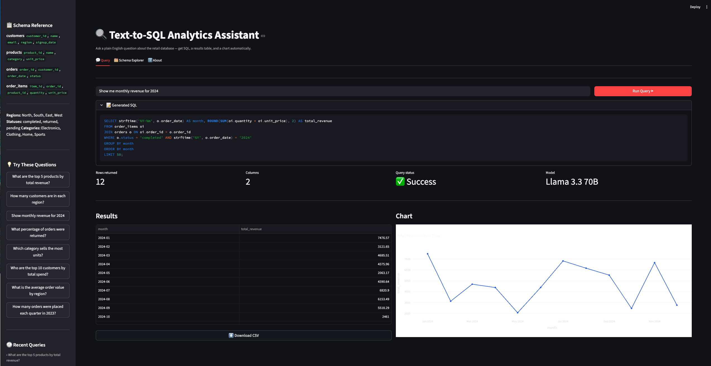
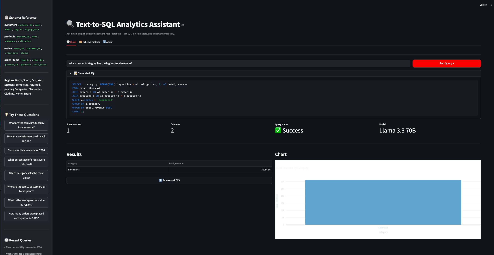

# 🔍 Text-to-SQL Analytics Assistant

An AI-powered analytics tool that converts plain English questions into SQL queries and returns results with auto-generated charts — no SQL knowledge required.


---







---

## 💡 What It Does

Type a question like:
> *"What are the top 5 products by revenue in 2024?"*

Get back:
- ✅ The generated SQL query (syntax highlighted)
- ✅ A live results table
- ✅ An automatically selected chart (line, bar, or scatter)
- ✅ CSV export of results

---

## 🖥️ Demo

| Feature | Description |
|---|---|
| Natural language input | Ask questions in plain English |
| Auto SQL generation | Llama 3.3 70B generates accurate SQLite queries |
| Auto chart selection | Line chart for time series, bar for categories, scatter for correlations |
| Schema explorer | Browse the live database schema inside the app |
| Query history | Sidebar tracks your recent questions |
| CSV export | Download any result set with one click |

---

## 🛠️ Tech Stack

| Layer | Technology |
|---|---|
| LLM | Groq API — Llama 3.3 70B |
| Database | SQLite (500 orders, 100 customers, 16 products) |
| Backend | Python — pandas, sqlite3 |
| Frontend | Streamlit |
| Charts | Plotly Express |

---

## 🗂️ Project Structure

```
text-to-sql-assistant/
├── app.py                    # Streamlit UI + auto-chart engine
├── requirements.txt
├── .env                      # Your Groq API key (not committed)
├── core/
│   ├── llm.py                # Groq API + schema-aware prompt engineering
│   └── executor.py           # SQL execution + 4-stage security pipeline
├── database/
│   ├── schema.sql            # Table definitions
│   └── seed.py               # Generates 500 realistic orders
└── utils/
    └── schema_inspector.py   # Dynamically extracts live DB schema
```

---

## ⚙️ Setup

### 1. Clone the repo
```bash
git clone https://github.com/SH-Shad/text-to-sql-assistant.git
cd text-to-sql-assistant
```

### 2. Create a virtual environment
```bash
python3 -m venv venv
source venv/bin/activate
```

### 3. Install dependencies
```bash
pip install -r requirements.txt
```

### 4. Add your Groq API key
Create a `.env` file in the project root:
```
GROQ_API_KEY=your_key_here
```
Get a free API key at [console.groq.com](https://console.groq.com)

### 5. Seed the database
```bash
python database/seed.py
```

### 6. Run the app
```bash
streamlit run app.py
```

Opens at `http://localhost:8501`

---

## 🗃️ Database Schema

```
customers (1) ──── (many) orders (1) ──── (many) order_items (many) ──── (1) products
```

| Table | Rows | Description |
|---|---|---|
| customers | 100 | Name, email, region, signup date |
| products | 16 | Name, category, unit price |
| orders | 500 | Customer, date, status (completed/returned/pending) |
| order_items | ~900 | Product, quantity, price at time of purchase |

**Revenue = `order_items.quantity × order_items.unit_price`**
Historical pricing is preserved on `order_items` — separate from current `products.unit_price` — so revenue calculations are always accurate.

---

## 🔒 Security Pipeline

Every generated SQL passes through 4 stages before touching the database:

| Stage | What It Blocks |
|---|---|
| 1. Statement allowlist | DROP, DELETE, INSERT, UPDATE, ALTER |
| 2. Multi-statement check | `SELECT ...; DROP TABLE ...` injection |
| 3. EXPLAIN pre-validation | Syntax errors before execution |
| 4. Empty result handling | Graceful message instead of blank UI |

---

## 💬 Example Questions

- What are the top 5 products by total revenue?
- How many customers are in each region?
- Show monthly revenue trends for 2024
- What percentage of orders were returned?
- Which product category sells the most units?
- Who are the top 10 customers by total spend?
- What is the average order value by region?
- How many orders were placed each quarter in 2023?

---

## 🧠 How the LLM Prompt Works

The system prompt is built dynamically on every query:

1. **Live schema injection** — `schema_inspector.py` reads the actual database at runtime and formats every table, column, type, and foreign key as text
2. **Sample value injection** — known categorical values (regions, statuses, categories) are included so the LLM uses correct filter values
3. **Few-shot examples** — 3 worked SQL examples teach the model the expected JOIN structure and aliasing style
4. **Hard rules** — revenue formula, date functions, row limits, and a `CANNOT_ANSWER` sentinel for out-of-scope questions
5. **Temperature = 0** — deterministic output, same question always returns same SQL

---

## 👤 Author

**Sajid** · Information Systems · University of Texas at Arlington  
GPA: 3.8 · Expected Graduation: May 2029
